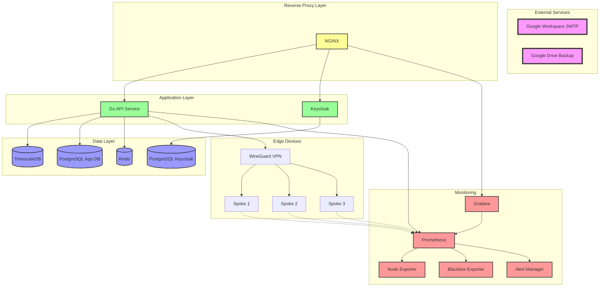
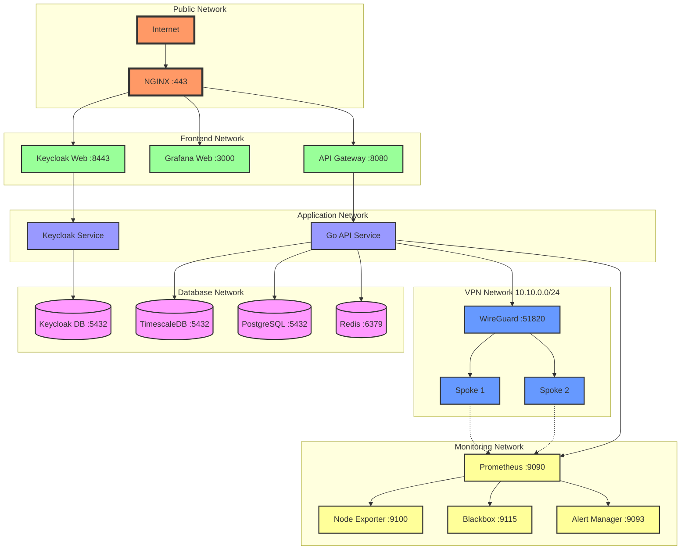
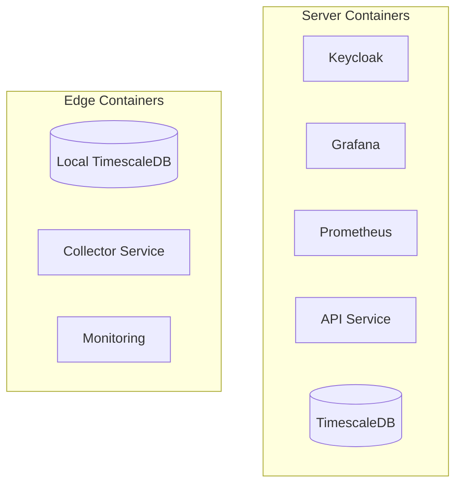
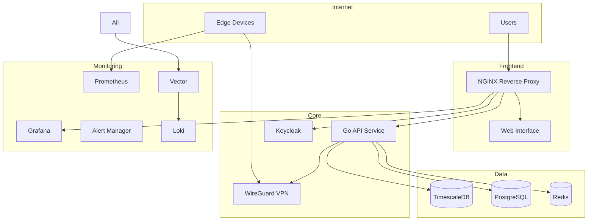

## general overview

Our project is w4b_v3, a bee-hive Monitoring System. It's a comprehensive solution for managing and monitoring distributed sensor networks, specifically designed for beehive monitoring but adaptable to various IoT scenarios.
The system follows a hub-and-spoke architecture with secure VPN connections and implements a multi-layered security approach.

## Server Architecture

we are on ubuntu 22.04

## Network Architecture

## Key Components

### Central Server (Hub)

- **VPN Server**: WireGuard-based secure communication
- **Authentication**: Keycloak-based identity management
- **API Service**: Go-based REST API
- **Monitoring**: Prometheus + Grafana stack
- **Storage**: TimescaleDB for time-series data

### Edge Devices (Spokes)

- **Hardware**: Raspberry Pi (v3/v5)
- **Local Storage**: TimescaleDB instance
- **Data Collection**: Python-based sensor collector
- **Monitoring**: Node exporter for system metrics
- **Security**: WireGuard VPN client, firewall rules

### Sensor Framework

- YAML-based configuration
- Pluggable sensor types
- Automated data collection
- Local buffering and sync
- Health monitoring and diagnostics

## Security Model

### Authentication Layers

1. Keycloak-based identity management
2. Role-based access control (RBAC)
3. VPN-level authentication
4. Service-level access control

### Access Roles

- **System Admin**: Full system access including SSH
- **Hive Admin**: Management of specific hives
- **User**: Data access and visualization
- **Guest**: Read-only public data access

### Network Security

- WireGuard VPN for all communications
- Isolated edge device networks
- Restricted service access
- Automated security updates

## Deployment

All components are containerized using Podman:

## Server System Overview

### Components

- **TimescaleDB**: Time-series data storage for sensor readings
- **PostgreSQL**: Application data storage (user preferences, configurations)
- **Keycloak**: Authentication and authorization
- **Prometheus & Grafana**: Monitoring and visualization
- **Redis**: Caching and rate limiting
- **Vector & Loki**: Log aggregation and management
- **WireGuard**: VPN for edge device connectivity
- **Go API Service**: Core application service
- **Alert Manager**: System alerts and notifications

### Architecture

## Container Management

We are using podman for container management. We have podman-compose installed.

