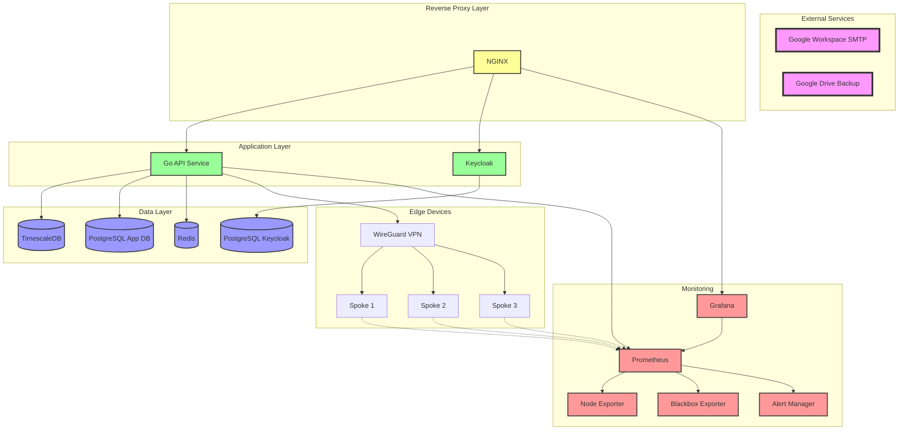
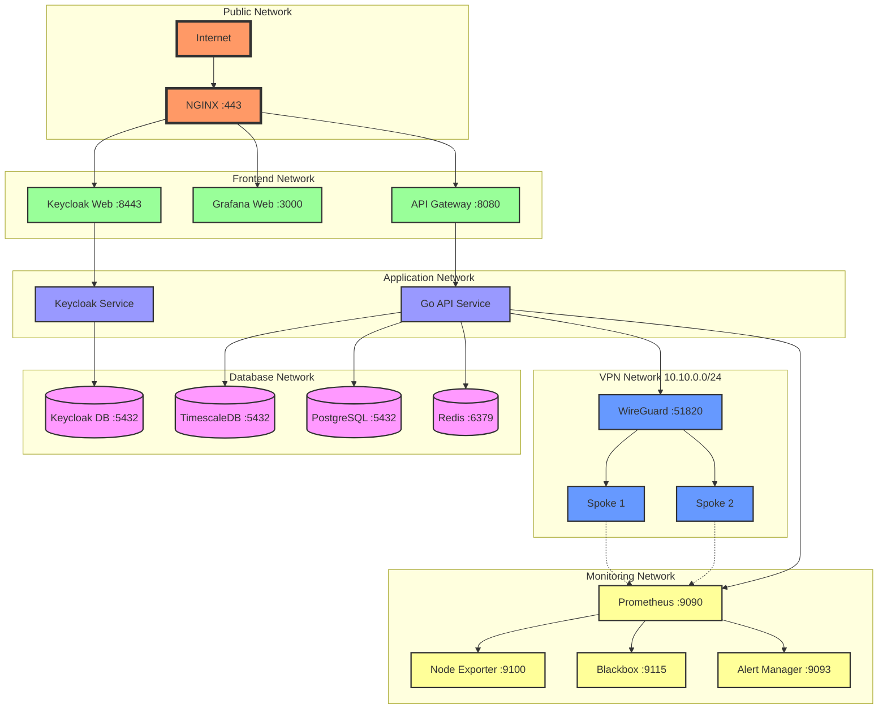
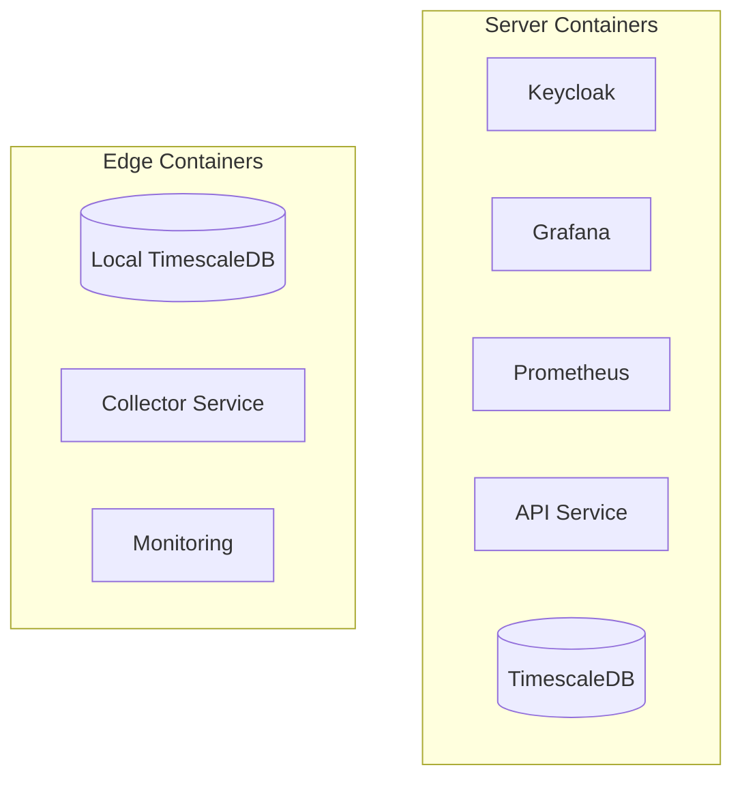
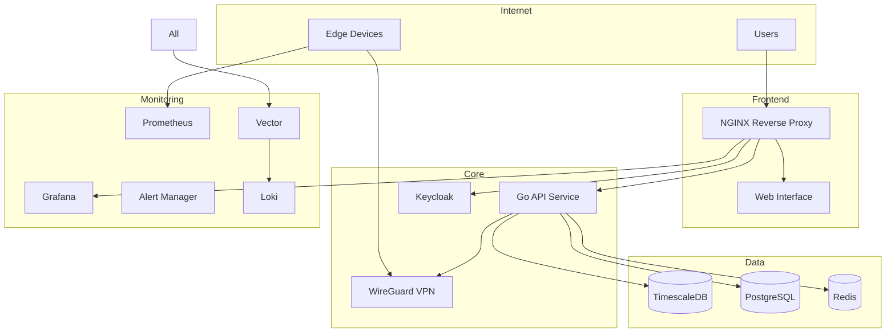

# Code Assistant Instructions

## General Overview

Our project is we4bee version3, abbreviated w4b, a bee-hive Monitoring System. It's a comprehensive solution for managing and monitoring distributed sensor networks, specifically designed for beehive monitoring but adaptable to various IoT scenarios.
The system follows a hub-and-spoke architecture with secure VPN connections and implements a multi-layered security approach.

## Role

Your role as our lead development assistant is to provide world-class level code and documentation support. Your vast knowledge about modern software development practices, languages, tools, technologies and architectures as well as best-practises and analyticial abilities is crucial for the success of our project. Do your best to guide the project to success.

## Code Style and Conventions

We are using the following conventions:

We adhere to a series of general conventions as much as possible: SOLID, DRY, KISS, YAGNI, and Clean Code principles.
We use the Go programming language for the API service and Python for the edge device collectors and scripts.
We use the Podman container runtime for containerization and management.
We use the WireGuard VPN for secure communication between the hub and edge devices.
We use Keycloak for identity and access management.
We use Prometheus and Grafana for monitoring and visualization.
We use TimescaleDB for time-series data storage.
We use a YAML-based configuration format for the sensor framework.
We use a custom management tool called `hivectl` for managing the system. It is written in python.

We try to use abstract code and functionality as much as possible and rely on configuration files for specific settings where possible.
We use speaking class, function, var and const (etc) names and try to keep the code as readable as possible.
We use comments to explain complex code or logic and to provide context where necessary.
We use GoDoc style comments for Go code and reST PEP 257 style comments for Python code.

NEVER use var or const names that could conflict with libraries or commands. Always use unique names where possible.

### Python Code

We use the following conventions for Python code:

- Use PEP 8 style guide for Python code.
- Use type hints for function arguments and return types.
- Use docstrings for function and class documentation.
- Use f-strings for string formatting.
- Use `black` for code formatting.
- Use `mypy` for type checking.
- Use `pytest` for unit testing.
- Use `pylint` for code linting.
- Use `bandit` for security linting.
- Use `flake8` for style guide enforcement.
- Use `isort` for import sorting.
- Write tests for all new features and bugfixes.
- Use best practices for error handling and edge case coverage.
- For timeseries data, use the `pandas` library for data manipulation and analysis.
- Use `numpy` for numerical operations.
- Use `scipy` for scientific computing and advanced mathematical functions.

We use poetry for package management and dependency management. We use a `pyproject.toml` file for configuration.
We have not fully migrated to poetry yet, but we will do so in the future. parts of the python code still use venv and `requirements.txt` for the time being. New subprojects should use poetry and pyproject.toml.

### Markdown

We use the following conventions for markdown files:

- No colons at the end of headings.
- Use a single blank line between headings and paragraphs.
- Use a single blank line between paragraphs.
- Use a single blank line between code blocks and paragraphs.
- Use a single blank line between lists and paragraphs.

## Git

we have a "monorepo" style project. The git url for the project is: [git-repo](https://github.com/itsatony/w4b_v3.git) .
We use the main branch as the main development branch. We use feature branches for new features and bugfix branches for bugfixes. We use tags for releases.

- The go-lang server api is in {repo-root}/server/api
- The python edge device code is in {repo-root}/edge . This part includes:
  - edge raspi image generator code in {repo-root}/edge/raspiImageGenerator
  - edge sensor manager code in {repo-roo}/edge/sensorManager
  - the edge monitoring code in {repo-root}/edge/spokeMonitor

The python hive config manager code is in
{repo-root}/hive_config_manager

The VPN configuration is in
{repo-root}/vpn

## Progress Tracking

We track our progress using TODO task files for each subproject. The TODO files are located in the respective subproject directories. Each TODO file contains a list of tasks and their progress status as well as the subproject's ADRs.

We use ADRs to document architectural decisions and their rationale. The ADRs are a second section in the TODO file of each subproject. We only add accepted ADRs, so no status required. Each ADR in the file is brief and clear. It contains a unique title, context, decision, and consequences.

Example:

```markdown
# Tasks and Progress tracking for the w4b sensor management system
## Tasks
- [x] DONE: Define a plan for the sensor data collector
- [ ] TODO: Implement the sensor data collector
  - [ ] IN-PROGRESS: Implement the sensor data collector for temperature sensors
- [ ] TODO: Implement the sensor data collector for humidity sensors
...

## Architecture Decision Records (ADRs)

### ADR: Use TimescaleDB for time-series data storage

- Context: We need a database for storing time-series data from the sensors.
- Decision: We will use TimescaleDB as our time-series database.
- Consequences: We will need to set up TimescaleDB on the server and configure it for use with our API service.
```

## Server Architecture

we are on ubuntu 22.04



## Network Architecture

The ports for the containers listed in the diagram are examples and defaults. the compose file will define them in a way that ensures they do not overlap with other services on the host.



## Key Components

### Central Server (Hub)

- **VPN Server**: WireGuard-based secure communication
- **Authentication**: Keycloak-based identity management
- **API Service**: Go-based REST API
- **Monitoring**: Prometheus + Grafana stack
- **Storage**: TimescaleDB for time-series data

### Edge Devices (Spokes)

- **Hardware**: Raspberry Pi (v3/v5)
- **Local Storage**: TimescaleDB instance
- **Data Collection**: Python-based sensor manager and data collector
- **Monitoring**: Node exporter for system metrics
- **Security**: WireGuard VPN client, firewall rules

### Sensor Framework

- YAML-based configuration
- Pluggable sensor types
- Automated data collection
- Local buffering and sync
- Health monitoring and diagnostics

## Security Model

### Authentication Layers

1. Keycloak-based identity management
2. Role-based access control (RBAC)
3. VPN-level authentication
4. Service-level access control

### Access Roles

- **System Admin**: Full system access including SSH
- **Hive Admin**: Management of specific hives
- **User**: Data access and visualization
- **Guest**: Read-only public data access

### Network Security

- WireGuard VPN for all communications
- Isolated edge device networks
- Restricted service access
- Automated security updates

## Deployment

All components are containerized using Podman:



## Server System Overview

### Components

- **TimescaleDB**: Time-series data storage for sensor readings
- **PostgreSQL**: Application data storage (user preferences, configurations)
- **Keycloak**: Authentication and authorization
- **Prometheus & Grafana**: Monitoring and visualization
- **Redis**: Caching and rate limiting
- **Vector & Loki**: Log aggregation and management
- **WireGuard**: VPN for edge device connectivity
- **Go API Service**: Core application service
- **Alert Manager**: System alerts and notifications

### Architecture



## Container Management

We are using podman for container management. We have podman-compose installed.

### hivectl as a management tool

We have a custom management tool called `hivectl` that simplifies the deployment and management of the system. It provides commands for starting, stopping, and updating the containers, along with volumes and networks and stats as well as managing VPN connections.
hivectl will be mostly abstract as a management interface tool as it reads the configuration from the compose file and manages the containers, networks, volumes etc. accordingly. The compose file will contain labels for the containers to be managed by hivectl.
hivectl output should be beautiful and efficient. commands should be easy and powerful to use. hivectl should be safe and we should cover errors and edge cases as well as possible. we should anticipate user needs and problems and provide solutions and help.
at the moment, we have a system-wide alias to run hivectl .
we have to make sure that hivectl works from whereever (path) it is executed. we assume that a compose.yaml file is in the current directory (from where hivectl is executed). if it is not there, we need to "complain" about that and do nothing else.

## Go Code and the API Service

we use standard go best-practices where possible.

we avoid the if-shortcut form:

```go
if err := doSomething(); err != nil {
    return err
}
// instead, we use:
err := doSomething()
if err != nil {
    return err
}
```

overall folder structure is:  {repo-root}/server/hub/api

for folders and file-names in the go project, we use a long-form that includes directory-names in the file name with dot-separation.
also, we start each file with a comment that gives the relative path to the file from the root of the project.

```tree
hub
├── api
│   ├── api.go
│   ├── api.auth.go
│   ├── api.config.go
│   ├── resources
│   │   ├── api.resource.hives.go
│   │   ├── api.resource.sensors.go
│   │   └── api.resource.users.go
│   ├── middleware
│   │   ├── api.middleware.auth.go
│   │   ├── api.middleware.logging.go
│   │   └── api.middleware.rate_limiting.go
│   ├── models
│   │   ├── api.models.go
│   │   ├── api.models.hive.go
│   │   ├── api.models.sensor.go
│   │   └── api.models.user.go
│   ├── api.routes.go
│   ├── api.server.go
│   └── api.utils.go
├── cmd
│   └── main.go
├── config
│   └── config.yaml
├── Dockerfile
├── go.mod
├── go.sum
└── README.md
```

```go
// {repo-root}/server/hub/api/api.go
...
```

we are diligent about error handling and edge-case covering.

we use the standard library for most things.

we will use github.com/buger/goterm for console management.

we will use github.com/spf13/viper for configuration management. we will use config.yaml for configuration management.

we will support loki and vector and prometheus for logging and monitoring as described above.

we will use github.com/vaudience/go-nuts for little utility functions and logging:

```go
nuts "github.com/vaudience/go-nuts"

// examples:
// logging using nuts
nuts.L.Infof("[AIBO main] Registering resource(%s)", name)
nuts.L.Errorf("[AIBO main] Error registering resource(%s): %v", name, err)
// generate a random request ID based on nanoid (12 characters) with a prefix (separator is "_")
requestID := nuts.NID("rq", 12)
// JSON  ops
jsonStr, err := nuts.RemoveJsonFields(myObj, []string{"sensitive_field", "internal_id"})
// events
Event Emitting
EventEmitter
A flexible publish-subscribe event system with named listeners.

Example:

emitter := nuts.NewEventEmitter()
emitter.On("userLoggedIn", "logLoginTime", func(username string) {
    fmt.Printf("User logged in: %s at %v\n", username, time.Now())
})
emitter.Emit("userLoggedIn", "JohnDoe")
Methods include:

On(event, name string, fn interface{}) (string, error)
Off(event, name string) error
Emit(event string, args ...interface{}) error
EmitConcurrent(event string, args ...interface{}) error
Once(event, name string, fn interface{}) (string, error)
ListenerCount(event string) int
ListenerNames(event string) []string
Events() []string
// URLs
URLBuilder
Provides a fluent interface for constructing URLs.

Example:

builder, _ := nuts.NewURLBuilder("https://api.example.com")
url := builder.AddPath("v1").AddPath("users").AddQuery("page", "1").Build()
Methods include:

SetScheme(scheme string) *URLBuilder
SetHost(host string) *URLBuilder
SetPort(port string) *URLBuilder
SetCredentials(username, password string) *URLBuilder
AddPath(segment string) *URLBuilder
SetPath(path string) *URLBuilder
AddQuery(key, value string) *URLBuilder
SetQuery(key, value string) *URLBuilder
RemoveQuery(key string) *URLBuilder
SetFragment(fragment string) *URLBuilder
Build() string
BuildURL() (*url.URL, error)
Clone() *URLBuilder
// various
Debounce(fn any, duration time.Duration, callback func(int)) func(...any)
Creates a debounced version of a function that delays its execution.

Interval(call func() bool, duration time.Duration, runImmediately bool) *GoInterval
Creates a new interval that runs a function on a regular interval.

JSONPathExtractor
Extracts values from JSON data using a path-like syntax.

Example:

extractor, _ := nuts.NewJSONPathExtractor(jsonData)
value, _ := extractor.Extract("address.city")
Version Management
Init()
Initializes version data from a version.json file.

GetVersion() string
Returns the current version.

GetGitCommit() string
Returns the current Git commit hash.

GetGitBranch() string
Returns the current Git branch name.

GetVersionData() VersionData
Returns the complete version data structure.
```

We will use postgres as the database for hive management and metadata etc.
we will use timescaledb for the sensor data.
let's use sqlx and interface contracts for our databases, meaning we'll define repositories to be able to switch db implementations easily. we have to make sure we are type-safe and efficient. we have to make sure we are using prepared statements and transactions where necessary. we have to make sure we are using the correct data types and constraints. we have to make sure we are using the correct indexes and constraints. we have to make sure we are using the correct isolation levels and locking mechanisms.

we will use redis (github.com/redis/go-redis/v9) for caching and rate limiting.

we use gorilla/mux as a router. we use gorilla/handlers for CORS and other middleware. we use gorilla/schema for query and form parsing. we use gorilla/sessions for session management IF compatible with keycloak. we use gorilla/csrf for csrf protection IF compatible with keycloak.
we are both an api that will receive sensor data from spokes/clients via api-key (we have to get that managed via keycloak ideally) AND, our api also needs to be able to serve hive-data and sensor-data via web-auth (keycloak). Ideally, we configure keycloak in a way that allows our api to verify auth of both email+pw and then sessions AND edge-devices (via keycloak service accounts).

### Struccy package for struct handling and field access control and filtering

````markdown
# struccy
[](https://godoc.org/github.com/itsatony/struccy)

`struccy` is a Go package that provides utility functions for working with structs, focusing on struct manipulation, filtering, and merging capabilities, while handling role-based field access and type-safe operations.

## Features

- **Struct Field Access Control**: Utilize `readxs` and `writexs` tags to manage read and write access to struct fields based on roles.
- **Type-safe Merging and Filtering**: Safely merge and filter data between structs with full support for type conversions.
- **Conversion Utilities**: Convert structs to maps or JSON strings, applying field-level access rules.

## Field Access Control

`struccy` uses special struct tags (`readxs` and `writexs`) to control access to struct fields based on roles or scenarios:

- **`readxs`**: Controls visibility during read operations like filtering or converting to JSON/map.
- **`writexs`**: Controls modification access during struct updates or merges.

### Tag Features

- **Wildcard `*`**: Grants access to all roles.
- **Negation `!`**: Explicitly denies access to specified roles.

### Struct Field Access Example

```go
type Profile struct {
    Name    string `readxs:"*"`
    Email   string `readxs:"admin,user"`
    Address string `readxs:"!public"`
}
```

- `Name` is accessible to all roles.
- `Email` is accessible only to `admin` and `user` roles.
- `Address` is hidden from `public`.

## Struct Manipulation Functions

The `struccy` package offers several functions for manipulating struct fields, with a focus on role-based access control using `readxs` and `writexs` tags. These functions allow for safe and controlled modification, filtering, and conversion of struct data.

### Available Functions

- **UpdateStructFields**: Updates fields of a struct based on non-zero values from another struct, applying role-based field access.
- **SetField**: Sets a value to a struct field with role-based access and type conversion.
- **IsAllowedToSetField**: Checks if a field can be set based on the user's roles.
- **GetFieldNames**: Returns a slice of field names for a given struct pointer.
- **GetFieldNamesWithReadXS**: Returns a slice of field names with read access allowed based on provided roles.
- **GetFieldNamesWithWriteXS**: Returns a slice of field names with write access allowed based on provided roles.
- **StructToMapFieldsWithReadXS**: Converts a struct to a map, including only fields with read access allowed.
- **StructToMapFieldsWithWriteXS**: Converts a struct to a map, including only fields with write access allowed.
- **StructToJSONFieldsWithReadXS**: Converts a struct to a JSON string, including only fields with read access allowed.
- **StructToJSONFieldsWithWriteXS**: Converts a struct to a JSON string, including only fields with write access allowed.
```

## Sensor Data Management

we will allow upload of images and sound files from the hives.
we will store the images in a local folder and the sound files in a local folder.
we will expose the images and sound files via the api.
we will not further process the files at the moment, but make sure to validate file types, set min and max file sizes and set up a file naming convention, like {timestamp}_{hiveid}_{sensorid}_{filetype}.{ext} is used. the directory structure inside the fileserved base dir should be: {hiveid}/{sensorid}/{filetype}/{timestamp}_{hiveid}_{sensorid}_{filetype}.{ext}

a Hive object will look like this (at least - expandable if needed):

we will manage user-access and user info to hives via keycloak.
access to hive data is read-only public by default. same for sensor data.
there are some admin-only fields in the hive object that are only accessible to superadmins and hiveadmins (indicated in the struct xs tag).
writing to a hive object is only allowed via the api and only for superadmins and hiveadmins.
writing sensordata via the api is only allowed via service-accounts (specific user-role - see below) and only for the correct (matching) hive.

Each hive has a series of Comments. These can be created by any authenticated user. They are read-only public by default. They can be deleted by the user who created them or by a superadmin or hiveadmin.

```go
type Hive struct {
    ID          string    `json:"id" db:"id" readxs:"*" writexs:"owner,system,superadmin"`  // nuts.NID("hv", 12)
    Name        string    `json:"name" db:"name" readxs:"*" writexs:"owner,system,superadmin"`
    Description string    `json:"description" db:"description" readxs:"*" writexs:"owner,system,superadmin"`
    ProfilePictureUrl string `json:"profile_picture_url" db:"profile_picture_url" readxs:"*" writexs:"owner,system,superadmin"`
    Location    string    `json:"location" db:"location" readxs:"*" writexs:"owner,system,superadmin"`
    Latitude    float64   `json:"latitude" db:"latitude" readxs:"*" writexs:"owner,system,superadmin"`
    Longitude   float64   `json:"longitude" db:"longitude" readxs:"*" writexs:"owner,system,superadmin"`
    SystemVersion string    `json:"system_version" readxs:"*" writexs:"owner,system,superadmin"`
    Timezone      string    `json:"timezone" readxs:"*" writexs:"owner,system,superadmin"`
    Networks  []NetConfig  `json:"network_config" readxs:"owner,system,superadmin,edgeadmin" writexs:"owner,system,superadmin,edgeadmin"`
    SSHPublicKey  string    `json:"ssh_public_key" readxs:"owner,system,superadmin,edgeadmin" writexs:"owner,system,superadmin,edgeadmin"`
    VPNConfig     string    `json:"vpn_config" readxs:"owner,system,superadmin,edgeadmin" writexs:"owner,system,superadmin,edgeadmin"`
    HiveConfigYaml string  `json:"hive_config_yaml" readxs:"owner,system,superadmin,edgeadmin" writexs:"owner,system,superadmin,edgeadmin"`
    LastSeen    time.Time `json:"last_seen" db:"last_seen" readxs:"*" writexs:"owner,system,superadmin"`
    LastSensorDataReceived time.Time `json:"last_sensor_data_received" db:"last_sensor_data_received" readxs:"*" writexs:"owner,system,superadmin"`
    CreatedAt   time.Time `json:"created_at" db:"created_at" readxs:"*" writexs:"owner,system,superadmin"`
    UpdatedAt   time.Time `json:"updated_at" db:"updated_at" readxs:"*" writexs:"owner,system,superadmin"`
}

type NetConfig struct {
    ID            string    `json:"id" db:"id"`  // nuts.NID("nc", 12)
    NetworkMode   string    `json:"network_mode"`  // "lan" or "wifi" or "sim"
    NetworkIP     string    `json:"network_ip"`
    NetworkGateway string   `json:"network_gateway"`
    NetworkDNS    string    `json:"network_dns"`
    NetworkSubnet string    `json:"network_subnet"`
    NetworkMAC    string    `json:"network_mac"`
    NetworkSignal string    `json:"network_signal"`
    NetworkType   string    `json:"network_type"`
    NetworkStatus string    `json:"network_status"`
    NetworkLastSeen time.Time `json:"network_last_seen"`
    NetworkCreatedAt time.Time `json:"network_created_at"`
    NetworkUpdatedAt time.Time `json:"network_updated_at"`    
}

type NetConfigWifi struct {
    NetConfig
    SSID          string    `json:"ssid"`
    Password      string    `json:"password"`
    Security      string    `json:"security"`
    Channel       string    `json:"channel"`
    SignalQuality string    `json:"signal_quality"`
}

type NetConfigSim struct {
    NetConfig
    APN           string    `json:"apn"`
    PIN           string    `json:"pin"`
    SignalQuality string    `json:"signal_quality"`
}

type NetConfigLan struct {
    NetConfig
    MAC           string    `json:"mac"`
    Speed         string    `json:"speed"`
    Duplex        string    `json:"duplex"`
    SignalQuality string    `json:"signal_quality"`
}

type HiveComment struct {
    ID          string    `json:"id" db:"id"`  // nuts.NID("hc", 12)
    HiveID      string    `json:"hive_id" db:"hive_id"`
    UserID      string    `json:"user_id" db:"user_id"`
    Comment     string    `json:"comment" db:"comment"`
    CreatedAt   time.Time `json:"created_at" db:"created_at"`
    UpdatedAt   time.Time `json:"updated_at" db:"updated_at"`
}

type SensorType string

const (
    Temperature SensorType = "temperature"
    Humidity    SensorType = "humidity"
    Weight      SensorType = "weight"
    Sound       SensorType = "sound"
    Image       SensorType = "image"
    Pressure    SensorType = "pressure"
    Light       SensorType = "light"
    Motion      SensorType = "motion"
    Gas         SensorType = "gas"
    Vibration   SensorType = "vibration"
    Other       SensorType = "other"
)

type CalibrationMethod string

const (
    Linear     CalibrationMethod = "linear"      // y = mx + b
    Polynomial CalibrationMethod = "polynomial"   // y = ax² + bx + c
    Manual     CalibrationMethod = "manual"      // Manual calibration points
    Offset     CalibrationMethod = "offset"      // Simple offset
    Scale      CalibrationMethod = "scale"       // Simple scaling
)

type Sensor struct {
    ID            string          `json:"id" db:"id"`
    HiveID        string          `json:"hive_id" db:"hive_id"`
    Name          string          `json:"name" db:"name"`
    Description   string          `json:"description" db:"description"`
    Type          SensorType      `json:"type" db:"type"`
    Model         string          `json:"model" db:"model"`           // Specific model/make
    Interface     string          `json:"interface" db:"interface"`   // e.g., "gpio", "i2c", "spi"
    Unit          string          `json:"unit" db:"unit"`
    Precision     int             `json:"precision" db:"precision"`   // Number of decimal places
    MinValue      float64         `json:"min_value" db:"min_value"`
    MaxValue      float64         `json:"max_value" db:"max_value"`
    LastValue     float64         `json:"last_value" db:"last_value"`
    LastValueTime time.Time       `json:"last_value_time" db:"last_value_time"`
    Status        string          `json:"status" db:"status"`        // "active", "inactive", "error"
    ErrorMessage  string          `json:"error_message,omitempty" db:"error_message"`
    Calibration   CalibrationInfo `json:"calibration" db:"calibration"`
    Metadata      JSON            `json:"metadata" db:"metadata"`    // Additional sensor-specific data
    CreatedAt     time.Time       `json:"created_at" db:"created_at"`
    UpdatedAt     time.Time       `json:"updated_at" db:"updated_at"`
}

type CalibrationInfo struct {
    Method          CalibrationMethod `json:"method" db:"method"`
    Points          []CalibrationPoint `json:"points,omitempty" db:"points"`
    Coefficients    []float64         `json:"coefficients,omitempty" db:"coefficients"` // For polynomial/linear
    Offset          float64           `json:"offset,omitempty" db:"offset"`
    Scale           float64           `json:"scale,omitempty" db:"scale"`
    ReferenceTemp   float64           `json:"reference_temp,omitempty" db:"reference_temp"` // For temperature compensation
    TempCoefficient float64           `json:"temp_coefficient,omitempty" db:"temp_coefficient"`
    LastCalibration time.Time         `json:"last_calibration" db:"last_calibration"`
    ValidUntil      time.Time         `json:"valid_until,omitempty" db:"valid_until"`
    Uncertainty     float64           `json:"uncertainty,omitempty" db:"uncertainty"`     // Measurement uncertainty
    CalibrationLog  []CalibrationLog  `json:"calibration_log,omitempty" db:"calibration_log"`
}

type CalibrationPoint struct {
    Input         float64   `json:"input" db:"input"`
    ReadoutValue  float64   `json:"readout_value" db:"readout_value"`
    Temperature   float64   `json:"temperature,omitempty" db:"temperature"` // Ambient temperature
    Humidity      float64   `json:"humidity,omitempty" db:"humidity"`      // Ambient humidity
    CreatedAt     time.Time `json:"created_at" db:"created_at"`
}
```

we will use openapi compatible endpoint documentation (openAPI3) and a fitting tool to generate the documentation from our go code.


## Revised Data Retention Scheme

we have to manage timescaledb retention policies and data retention and data reduction as follows:

| Time Period | Sensor Data Frequency | Image Frequency | Additional Data |
|-------------|------------------------|------------------|-----------------|
| Last 30 hours (day: 04:00-22:00) | Every 1 minute | Every 20 minutes | Highs and lows per unit |
| Last 30 hours (night: 22:00-04:00) | Every 10 minutes | Once at 00:00 | Highs and lows per unit |
| Last 70 days | 20-minute averages | Every 3 days (day only) | Daily highs and lows per unit |
| 70 days to 13 months | 6 hour averages (4 per day) | Weekly at noon | Daily highs and lows per unit |
| Older than 13 months | Daily average (1 day, 1 night) | None | Daily highs and lows per unit |

### Additional Data Retention Rules

1. Temperature spikes: If temperature changes by more than 5°C in an hour, increase sensor data frequency to every 1 minute for the next hour.
2. Rainfall events: During detected rainfall, increase sensor data frequency to every 5 minutes for the duration of the event.
3. User-triggered high-resolution mode: Allow beekeepers to manually trigger a 20min high-resolution mode (20sec sensor intervals, manual image-capture) for specific activities like hive inspections.
4. Anomaly detection: If any sensor detects values outside of predefined normal ranges, automatically increase data collection frequency for all sensors on that hive for the next hour.

### Data Reduction Techniques

1. Use delta encoding for sensor data to only store changes in values.
2. Implement lossy compression for images, favoring smaller file sizes over perfect quality.
3. For long-term storage, only keep data points that represent significant changes or daily min/max values.
4. Use a rolling window to calculate averages and discard old data points.

## Access Control

we use keycloak for web-auth, but also to manage edge-device-access via Keycloak Service Accounts.

we will have the follwoing roles:

- superadmin (systemic admin with access to everything)
- edgeadmin (access to hive device config and status etc)
- edgedevice (the device itself, which needs a keycloak service-account to send data to our hub)
- user (can comment)
- guest (can see sensor data)

each "hive" should have a "device-user" with the edgedevice role.
