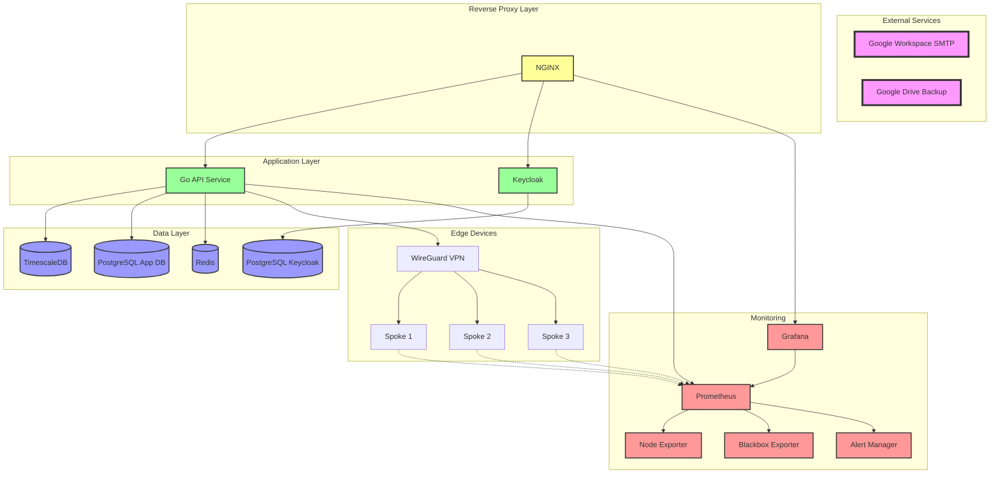
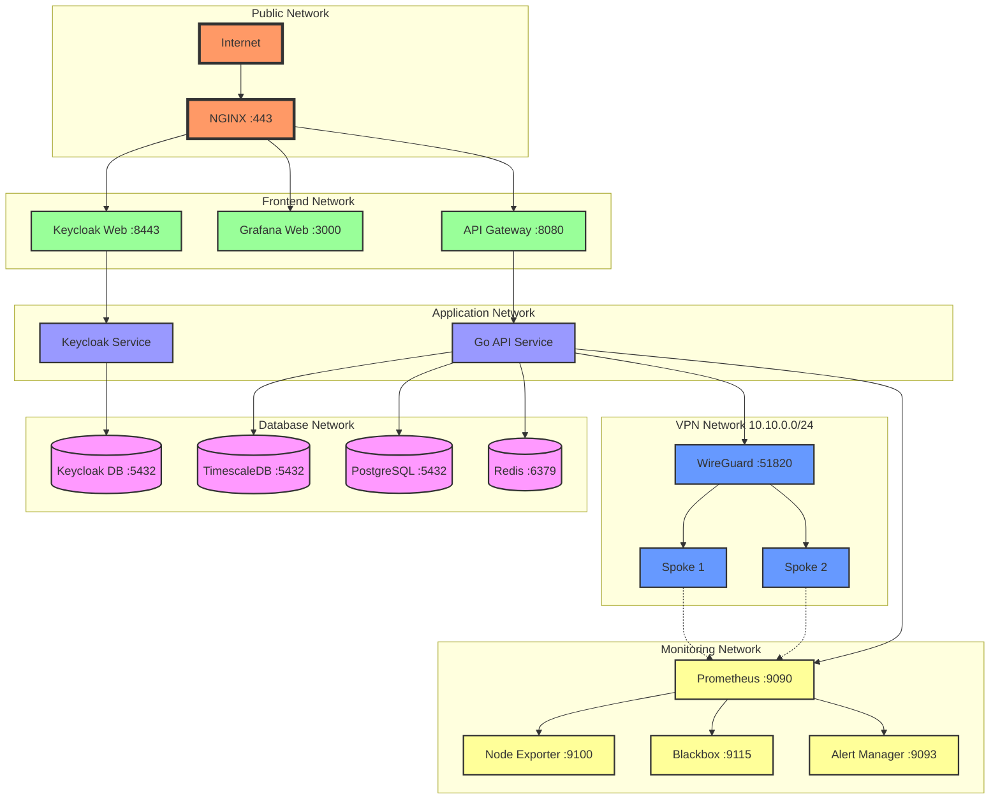
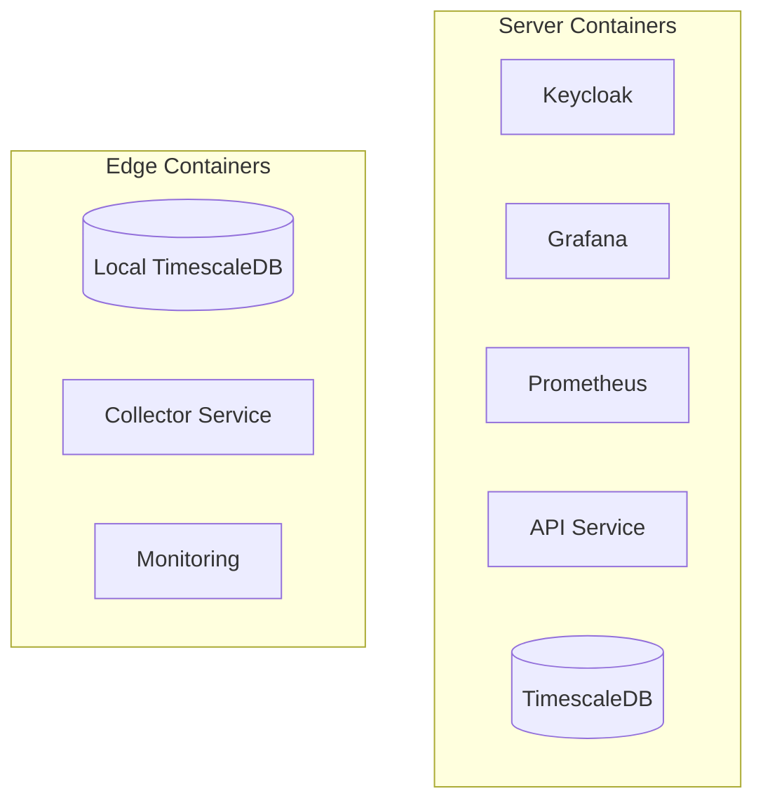
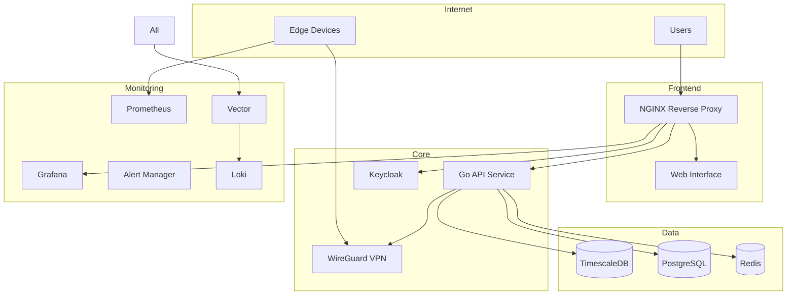

# Code Assistant Instructions

## General Overview

Our project is we4bee version3, abbreviated w4b, a bee-hive Monitoring System. It's a comprehensive solution for managing and monitoring distributed sensor networks, specifically designed for beehive monitoring but adaptable to various IoT scenarios.
The system follows a hub-and-spoke architecture with secure VPN connections and implements a multi-layered security approach.

## Role

Your role as our lead development assistant is to provide world-class level code and documentation support. Your vast knowledge about modern software development practices, languages, tools, technologies and architectures as well as best-practises and analyticial abilities is crucial for the success of our project. Do your best to guide the project to success.

## Code Style and Conventions

We are using the following conventions:

We adhere to a series of general conventions as much as possible: SOLID, DRY, KISS, YAGNI, and Clean Code principles.
We use the Go programming language for the API service and Python for the edge device collectors and scripts.
We use the Podman container runtime for containerization and management.
We use the WireGuard VPN for secure communication between the hub and edge devices.
We use Keycloak for identity and access management.
We use Prometheus and Grafana for monitoring and visualization.
We use TimescaleDB for time-series data storage.
We use a YAML-based configuration format for the sensor framework.
We use a custom management tool called `hivectl` for managing the system. It is written in python.

We try to use abstract code and functionality as much as possible and rely on configuration files for specific settings where possible.
We use speaking class, function, var and const (etc) names and try to keep the code as readable as possible.
We use comments to explain complex code or logic and to provide context where necessary.
We use GoDoc style comments for Go code and reST PEP 257 style comments for Python code.

## Server Architecture

we are on ubuntu 22.04

## Network Architecture

The ports for the containers listed in the diagram are examples and defaults. the compose file will define them in a way that ensures they do not overlap with other services on the host.

## Key Components

### Central Server (Hub)

- **VPN Server**: WireGuard-based secure communication
- **Authentication**: Keycloak-based identity management
- **API Service**: Go-based REST API
- **Monitoring**: Prometheus + Grafana stack
- **Storage**: TimescaleDB for time-series data

### Edge Devices (Spokes)

- **Hardware**: Raspberry Pi (v3/v5)
- **Local Storage**: TimescaleDB instance
- **Data Collection**: Python-based sensor collector
- **Monitoring**: Node exporter for system metrics
- **Security**: WireGuard VPN client, firewall rules

### Sensor Framework

- YAML-based configuration
- Pluggable sensor types
- Automated data collection
- Local buffering and sync
- Health monitoring and diagnostics

## Security Model

### Authentication Layers

1. Keycloak-based identity management
2. Role-based access control (RBAC)
3. VPN-level authentication
4. Service-level access control

### Access Roles

- **System Admin**: Full system access including SSH
- **Hive Admin**: Management of specific hives
- **User**: Data access and visualization
- **Guest**: Read-only public data access

### Network Security

- WireGuard VPN for all communications
- Isolated edge device networks
- Restricted service access
- Automated security updates

## Deployment

All components are containerized using Podman:

## Server System Overview

### Components

- **TimescaleDB**: Time-series data storage for sensor readings
- **PostgreSQL**: Application data storage (user preferences, configurations)
- **Keycloak**: Authentication and authorization
- **Prometheus & Grafana**: Monitoring and visualization
- **Redis**: Caching and rate limiting
- **Vector & Loki**: Log aggregation and management
- **WireGuard**: VPN for edge device connectivity
- **Go API Service**: Core application service
- **Alert Manager**: System alerts and notifications

### Architecture

## Container Management

We are using podman for container management. We have podman-compose installed.

### hivectl as a management tool

We have a custom management tool called `hivectl` that simplifies the deployment and management of the system. It provides commands for starting, stopping, and updating the containers, along with volumes and networks and stats as well as managing VPN connections.
hivectl will be mostly abstract as a management interface tool as it reads the configuration from the compose file and manages the containers, networks, volumes etc. accordingly. The compose file will contain labels for the containers to be managed by hivectl.
hivectl output should be beautiful and efficient. commands should be easy and powerful to use. hivectl should be safe and we should cover errors and edge cases as well as possible. we should anticipate user needs and problems and provide solutions and help.
at the moment, we have a system-wide alias to run hivectl .
we have to make sure that hivectl works from whereever (path) it is executed. we assume that a compose.yaml file is in the current directory (from where hivectl is executed). if it is not there, we need to "complain" about that and do nothing else.