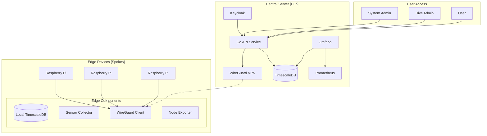
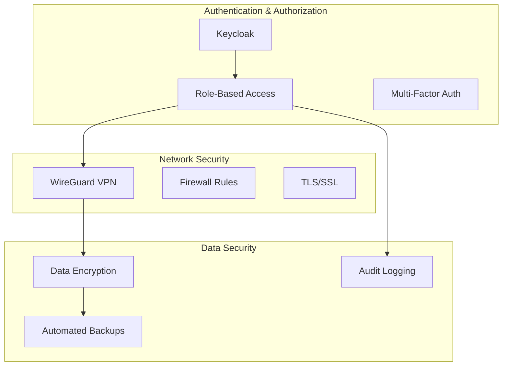
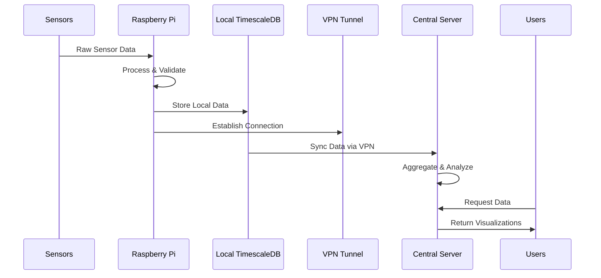
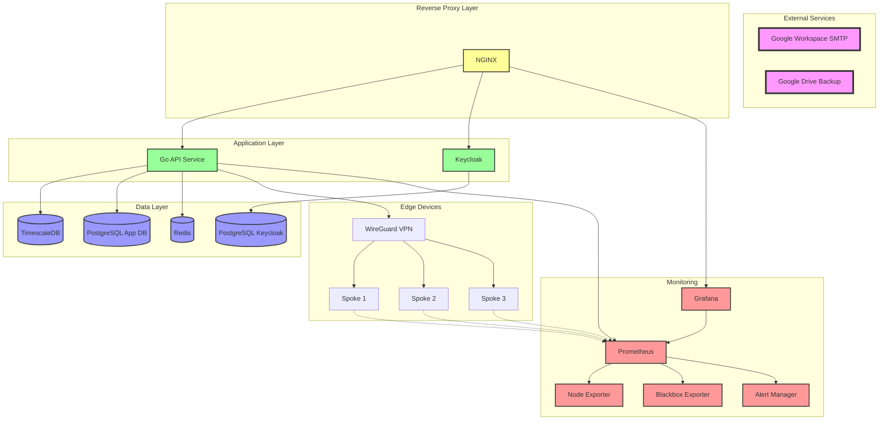
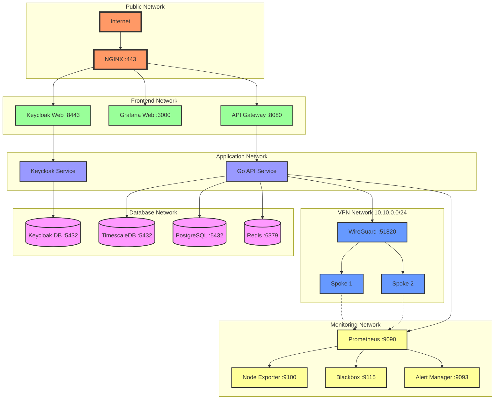
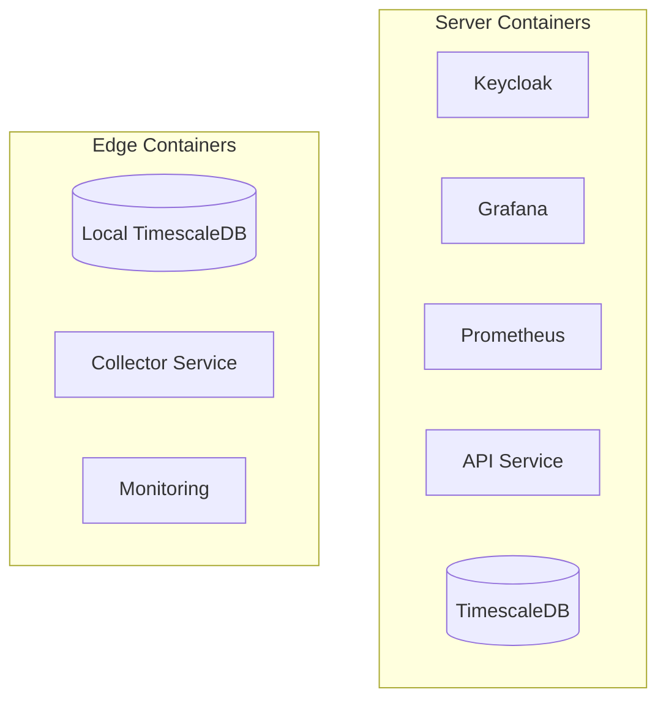
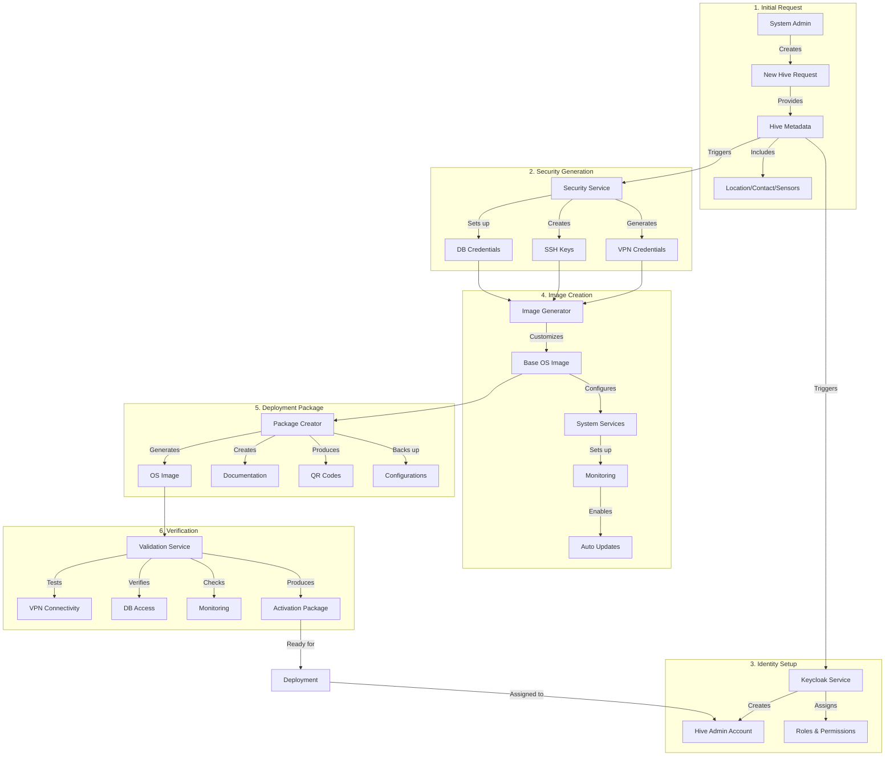

# w4b_v3 Hive Monitoring System

a sensordata collection system

(Claude3.5sonnet discussion system setup)[https://claude.ai/chat/050c228a-4d85-4138-9469-7529427e008e]

## System Overview

The Hive Monitoring System is a comprehensive solution for managing and monitoring distributed sensor networks, specifically designed for beehive monitoring but adaptable to various IoT scenarios. The system follows a hub-and-spoke architecture with secure VPN connections and implements a multi-layered security approach.

### Core Architecture



### Security Layers



### Data Flow



## Server Architecture



## Network Architecture



## Key Components

### Central Server (Hub)

- **VPN Server**: WireGuard-based secure communication
- **Authentication**: Keycloak-based identity management
- **API Service**: Go-based REST API
- **Monitoring**: Prometheus + Grafana stack
- **Storage**: TimescaleDB for time-series data

### Edge Devices (Spokes)

- **Hardware**: Raspberry Pi (v3/v5)
- **Local Storage**: TimescaleDB instance
- **Data Collection**: Python-based sensor collector
- **Monitoring**: Node exporter for system metrics
- **Security**: WireGuard VPN client, firewall rules

### Sensor Framework

- YAML-based configuration
- Pluggable sensor types
- Automated data collection
- Local buffering and sync
- Health monitoring and diagnostics

## Security Model

### Authentication Layers

1. Keycloak-based identity management
2. Role-based access control (RBAC)
3. VPN-level authentication
4. Service-level access control

### Access Roles

- **System Admin**: Full system access including SSH
- **Hive Admin**: Management of specific hives
- **User**: Data access and visualization
- **Guest**: Read-only public data access

### Network Security

- WireGuard VPN for all communications
- Isolated edge device networks
- Restricted service access
- Automated security updates

## Deployment

All components are containerized using Podman:



## New Hive Setup

The hive onboarding process involves several coordinated steps:

1. Hive Definition Phase:
   - System admin creates new hive entry via web interface
   - Provides basic metadata (location, contact info, timezone)
   - Assigns unique hive ID (format: "hive_XXXXX")
   - Defines sensor configuration and requirements
   - Sets up hive-specific admin account

2. Security Setup Phase:
   - System generates unique VPN credentials
   - Creates SSH keypair for secure access
   - Generates database credentials
   - Configures firewall rules specific to this hive
   - Creates Keycloak roles and permissions

3. Image Generation Phase:
   - Pulls base Raspberry Pi OS image
   - Injects VPN, SSH, and database configurations
   - Configures sensor collector with provided settings
   - Sets up monitoring and logging
   - Configures automatic updates and maintenance

4. Administration Setup:
   - Creates hive-specific admin in Keycloak
   - Assigns appropriate roles and permissions
   - Sets up monitoring dashboards
   - Configures alert rules and notifications

5. Deployment Package Creation:
   - Generates the customized OS image
   - Creates deployment documentation
   - Packages configuration backup
   - Generates QR codes for easy mobile access

6. Verification & Activation:
   - System validates all generated configurations
   - Tests VPN connectivity settings
   - Verifies database access
   - Checks monitoring configuration
   - Prepares activation checklist

This diagram shows the complete flow from initial request to deployment-ready package. Each subgraph represents a major phase in the onboarding process, with clear dependencies and data flow between steps.



## Data Management

### Local Storage

- Short-term sensor data storage
- System health metrics
- Configuration data
- Local logs and diagnostics

### Central Storage

- Long-term data aggregation
- Cross-hive analytics
- System-wide monitoring
- Audit logs and security events

## Monitoring & Diagnostics

### Edge Monitoring

- Sensor health and status
- System resources (CPU, memory, disk)
- Network connectivity
- Service status
- Data collection metrics

### Central Monitoring

- Fleet-wide system health
- Data collection statistics
- Security events
- Performance metrics
- User activity

## Development & Maintenance

### Version Control

Single Git repository with structured layout:

```
/
├── docs/
├── server/
│   ├── api/
│   ├── monitoring/
│   └── deployment/
├── edge/
│   ├── collector/
│   ├── sensors/
│   └── monitoring/
├── deployment/
│   ├── server/
│   └── edge/
└── tools/
```

### Continuous Integration

- Automated testing
- Image building
- Security scanning
- Documentation generation

This system is designed to be:

- **Scalable**: Supporting hundreds of edge devices
- **Secure**: Multi-layered security approach
- **Maintainable**: Well-documented and modular
- **Reliable**: Robust data collection and storage
- **Extensible**: Pluggable sensor framework