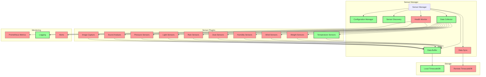
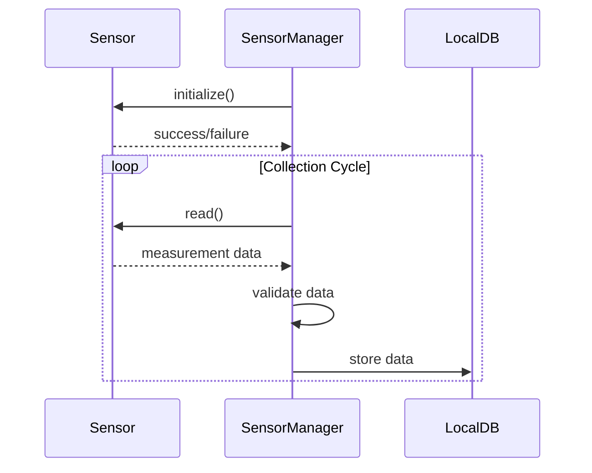

# Sensor Manager System Plan - MVP Approach

## 1. Overview & Architecture

The Sensor Manager system is a key component of the w4b (we4bee) v3 hive monitoring platform. It provides an extensible, configurable framework for collecting, processing, and storing sensor data from beehives. The system follows a modular, plugin-based architecture to support diverse sensor types while maintaining a consistent, robust data collection pipeline.

### MVP Strategy

For the Minimum Viable Product (MVP), we will:

1. Implement the core framework with abstractions for all components
2. Create working implementations only for the most critical components
3. Use dummy/mock implementations for non-critical components
4. Focus on a single sensor type (temperature) for complete implementation
5. Design interfaces that support future expansion

This approach allows us to build a complete end-to-end solution quickly while maintaining the architecture needed for full implementation later.

### Key Design Principles

- **Modularity**: Separate sensor interfaces from core collection logic
- **Configurability**: YAML-based configuration for all aspects of the system
- **Reliability**: Robust error handling, retries, and local buffering
- **Efficiency**: Optimized collection intervals and resource usage
- **Security**: Data validation and secure transmission
- **Extensibility**: Easy addition of new sensor types and metrics

### High-Level Architecture



## 2. Sensor Framework Design

The sensor framework provides a unified interface for interacting with different types of sensors while abstracting away the hardware-specific details.

### MVP Implementation

For the MVP, we will:
- Implement the full SensorBase abstract interface
- Create a complete implementation for temperature sensors
- Provide dummy implementations for all other sensor types
- Implement basic configuration loading and validation
- Use local database storage with simplified schema

### Core Components

1. **Sensor Base Class**: Abstract interface defining standard methods for all sensors
2. **Sensor Type Implementations**: Concrete implementations for each sensor type (only temperature for MVP)
3. **Sensor Registry**: Central repository of available sensor implementations
4. **Sensor Factory**: Creates sensor instances based on configuration
5. **Sensor Discovery**: Auto-detects available sensors on the system (simplified for MVP)

### Sensor Interface

```python
class SensorBase:
    def __init__(self, sensor_id, interface_config, calibration_config):
        # Initialize sensor with configuration
        pass
        
    async def initialize(self):
        # Prepare sensor for operation
        pass
        
    async def read(self):
        # Read sensor values, returning standardized measurement dict
        pass
        
    async def calibrate(self):
        # Perform calibration routine
        pass
        
    async def validate(self):
        # Validate sensor functionality
        pass
        
    async def cleanup(self):
        # Release resources
        pass
        
    def get_metadata(self):
        # Return sensor metadata
        pass
```

## 3. Sensor Types Implementation

### MVP Focus: Temperature Sensors

For the MVP, we will fully implement only temperature sensors, specifically:
- 1-Wire temperature sensors (DS18B20)
- Support for multiple temperature sensor instances
- Complete calibration and validation

### Implementation for Other Sensors

For all other sensor types, we will:
- Create stub implementations that return dummy data
- Implement the full interface but with simplified functionality
- Structure the code to make it easy to replace dummy implementations later
- Ensure configuration parsing works for all sensor types

### Sensor Types from Legacy System

| Sensor Type | Interface | MVP Implementation |
|-------------|-----------|-------------------|
| TemperatureW1Sensor | 1-Wire | **Full implementation** |
| WindSensor | I2C (0x4) | Dummy implementation returning random values |
| RainSensor | I2C (0x4) | Dummy implementation returning random values |
| PhotoSensor | I2C (0x29) | Dummy implementation returning random values |
| HumiditySensor | I2C (0x40) | Dummy implementation returning random values |
| FineDustSensor | I2C (0x4) | Dummy implementation returning random values |
| BalanceSensor | I2C (0x4) | Dummy implementation returning random values |
| PressureSensor | I2C (0x76) | Dummy implementation returning random values |

## 4. Data Collection Strategy

### MVP Approach

For the MVP, we will implement:
- Fixed collection intervals based on configuration (no adaptive collection)
- Simple data buffering in memory
- Direct storage to local database
- Basic error handling and retries

Future versions will add:
- Adaptive collection based on events and anomalies
- Sophisticated buffering and batching
- Bandwidth-aware synchronization

### Collection Process (MVP)



## 5. Data Storage & Retention

### MVP Storage Strategy

For the MVP, we will:
- Implement local TimescaleDB storage only
- Use a simplified schema focused on sensor readings
- Implement basic retention policies
- Skip synchronization with central hub (implement sync interface with dummy)
- Store only scalar sensor values (no media files)

### Local Storage Schema (MVP)

```sql
CREATE TABLE sensor_readings (
    time TIMESTAMPTZ NOT NULL,
    hive_id TEXT NOT NULL,
    sensor_id TEXT NOT NULL,
    metric_name TEXT NOT NULL,
    value DOUBLE PRECISION NOT NULL,
    unit TEXT NOT NULL,
    status TEXT DEFAULT 'valid'
);

SELECT create_hypertable('sensor_readings', 'time');
```

### Future Extensions

The design will support these future extensions:
- Synchronization with central hub
- Media file storage and management
- Advanced data retention and compression
- Anomaly marking and special event tagging

## 6. Calibration & Validation

### MVP Implementation

For the MVP, we will implement:
- Linear calibration for temperature sensors (offset and scale)
- Basic range validation (min/max values)
- Simple error flagging for out-of-range values

Future versions will add:
- Advanced calibration methods
- Cross-sensor validation
- Statistical outlier detection
- Trend analysis

## 7. Error Handling & Resilience

### MVP Approach

For the MVP, we will implement:
- Basic error logging
- Simple retry mechanism for failed readings
- Status tracking for sensors
- Graceful shutdown and cleanup

Future versions will add:
- Advanced error recovery strategies
- Circuit breaking for failing components
- Auto-recovery mechanisms
- Comprehensive diagnostics

## 8. Monitoring & Diagnostics

### MVP Implementation

For the MVP, we will implement:
- Basic logging to files and console
- Simple sensor status tracking
- Minimal Prometheus metrics (sensor status and readings)

Future versions will add:
- Comprehensive metrics collection
- Alerting and notifications
- Health endpoints and self-tests
- Performance monitoring

## 9. Implementation Roadmap

### MVP Phase (Current Focus)

1. Core Framework
   - Sensor interface and base class
   - Configuration loading
   - Basic sensor factory
   - Simple logging setup

2. Temperature Sensor Support
   - 1-Wire temperature sensor driver
   - Basic calibration support
   - Reading and validation

3. Local Storage
   - TimescaleDB setup
   - Basic schema
   - Simple data storage operations

4. Simple Monitoring
   - Basic logging
   - Simple Prometheus metrics

### Future Phases

Will be planned based on MVP learnings and prioritized as needed.

## 10. Future Enhancements (Post-MVP)

- Full implementation of all sensor types
- Advanced calibration and validation
- Media file handling
- Data synchronization with central hub
- Adaptive collection intervals
- Comprehensive monitoring and alerting
- User-triggered high-resolution mode
- Advanced error handling and recovery
