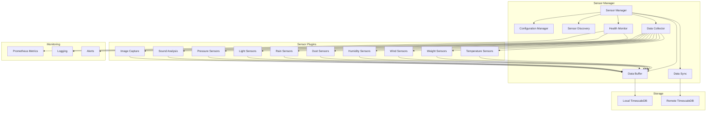
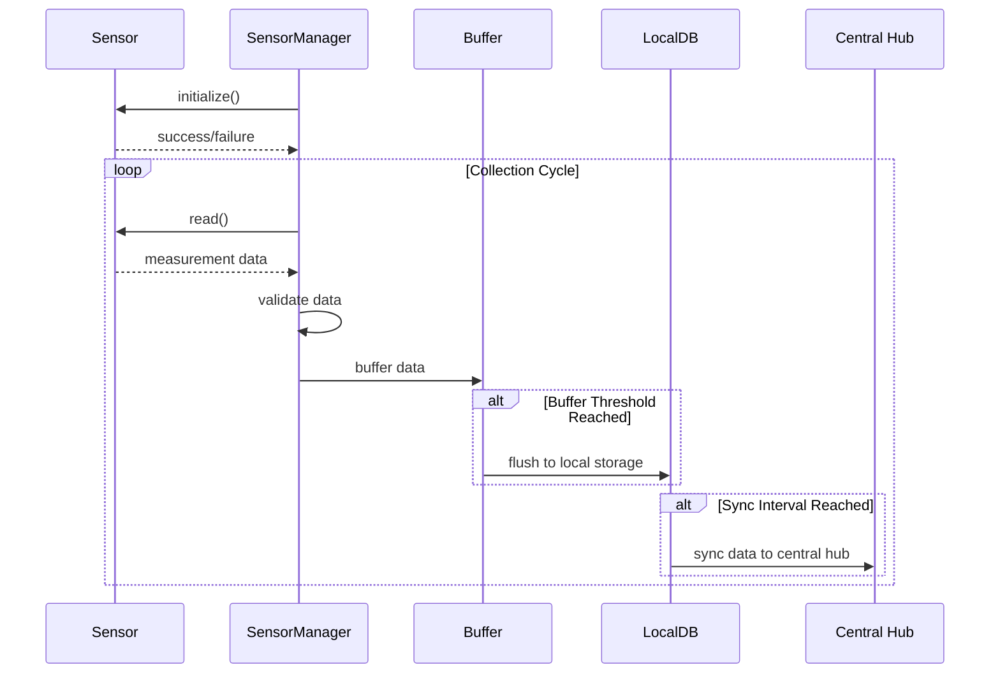

# Sensor Manager System Plan

## 1. Overview & Architecture

The Sensor Manager system is a key component of the w4b (we4bee) v3 hive monitoring platform. It provides an extensible, configurable framework for collecting, processing, and storing sensor data from beehives. The system follows a modular, plugin-based architecture to support diverse sensor types while maintaining a consistent, robust data collection pipeline.

### Key Design Principles

- **Modularity**: Separate sensor interfaces from core collection logic
- **Configurability**: YAML-based configuration for all aspects of the system
- **Reliability**: Robust error handling, retries, and local buffering
- **Efficiency**: Optimized collection intervals and resource usage
- **Security**: Data validation and secure transmission
- **Extensibility**: Easy addition of new sensor types and metrics

### High-Level Architecture



## 2. Sensor Framework Design

The sensor framework provides a unified interface for interacting with different types of sensors while abstracting away the hardware-specific details.

### Core Components

1. **Sensor Base Class**: Abstract interface defining standard methods for all sensors
2. **Sensor Type Implementations**: Concrete implementations for each sensor type
3. **Sensor Registry**: Central repository of available sensor implementations
4. **Sensor Factory**: Creates sensor instances based on configuration
5. **Sensor Discovery**: Auto-detects available sensors on the system

### Sensor Interface

```python
class SensorBase:
    def __init__(self, sensor_id, interface_config, calibration_config):
        # Initialize sensor with configuration
        pass
        
    async def initialize(self):
        # Prepare sensor for operation
        pass
        
    async def read(self):
        # Read sensor values, returning standardized measurement dict
        pass
        
    async def calibrate(self):
        # Perform calibration routine
        pass
        
    async def validate(self):
        # Validate sensor functionality
        pass
        
    async def cleanup(self):
        # Release resources
        pass
        
    def get_metadata(self):
        # Return sensor metadata
        pass
```

## 3. Sensor Types Implementation

We'll implement sensor drivers for all the sensor types identified in the existing system, plus additional sensors for modern hive monitoring needs.

### Sensor Types from Legacy System

| Sensor Type | Interface | Measurement | Implementation Notes |
|-------------|-----------|-------------|---------------------|
| WindSensor | I2C (0x4) | Wind speed | Read wind speed from I2C bus, calculate with diameter |
| RainSensor | I2C (0x4) | Rainfall | Read rainfall data from I2C bus |
| PhotoSensor | I2C (0x29) | Light levels | Configure integration time and gain |
| HumiditySensor | I2C (0x40) | Humidity | Read humidity from I2C bus |
| FineDustSensor | I2C (0x4) | PM2.5, PM10 | Read particulate matter measurements |
| BalanceSensor | I2C (0x4) | Weight | Apply calibration offset and factor |
| PressureSensor | I2C (0x76) | Pressure | Adjust for altitude |
| TemperatureW1Sensor | 1-Wire | Temperature | Read from specific 1-Wire path |

### New Sensor Types

| Sensor Type | Interface | Measurement | Implementation Notes |
|-------------|-----------|-------------|---------------------|
| SoundAnalyzer | USB/GPIO | Audio | Record and analyze sounds |
| CameraCapture | USB/CSI | Image | Capture and store images |
| CO2Sensor | I2C | CO2 levels | Monitor carbon dioxide |
| VOCSensor | I2C | VOC levels | Monitor volatile organic compounds |
| OpenWeatherSensor | API | Weather data | Retrieve from online service |
| MultiTempArray | 1-Wire | Multiple temperatures | Monitor temperature at different points |

### Implementation Approach

Each sensor type will be implemented as a Python module that inherits from the SensorBase class. The module will handle:

1. **Hardware Communication**: Direct interaction with hardware via appropriate libraries
2. **Data Processing**: Converting raw readings to standardized units
3. **Calibration**: Applying calibration factors to raw readings
4. **Validation**: Ensuring readings are within expected ranges
5. **Error Handling**: Robust handling of hardware communication failures

## 4. Data Collection Strategy

The data collection strategy implements the data retention scheme requirements while optimizing for resource usage and network bandwidth.

### Collection Intervals

| Time Period | Collection Frequency | Storage Strategy |
|-------------|----------------------|------------------|
| Day (04:00-22:00) | Every 1 minute | Store every reading |
| Night (22:00-04:00) | Every 10 minutes | Store every reading |
| Special Events | Variable (as frequent as 20 sec) | Store every reading |

### Adaptive Collection

The system will implement adaptive collection based on:

1. **Anomaly Detection**: Increase frequency when readings are outside normal ranges
2. **Event Detection**: Increase frequency during rainfall, temperature spikes, etc.
3. **User Requests**: Allow manual triggering of high-resolution mode
4. **Resource Constraints**: Reduce frequency if system resources are constrained
5. **Battery Conservation**: Adjust frequency based on battery level (for battery-powered deployments)

### Collection Process



## 5. Data Storage & Retention

The system will implement a multi-tiered storage strategy to balance between local storage constraints and data retention requirements.

### Local Storage (TimescaleDB)

- **Recent Data**: Full resolution data for the last 7 days
- **Medium-term Data**: Downsampled data (20-minute averages) for 70 days
- **Long-term Data**: Highly downsampled data (daily averages) for 13 months
- **Automated Cleanup**: Retention policies to automatically remove old data
- **Data Compression**: TimescaleDB native compression for efficient storage

### Data Synchronization

- **Regular Sync**: Periodic synchronization with central hub
- **Adaptive Sync**: More frequent sync for critical data or anomalies
- **Bandwidth-aware**: Throttle sync during limited connectivity
- **Delta Sync**: Only sync new or changed data
- **Resumable Sync**: Continue interrupted syncs from last position

### Media Storage

- **Images**: Store locally with metadata, sync based on importance
- **Audio**: Pre-filter audio on-device, only store segments of interest
- **File Naming Convention**: `{timestamp}_{hive_id}_{sensor_id}_{filetype}.{ext}`
- **Directory Structure**: `{hive_id}/{sensor_id}/{filetype}/{files}`

## 6. Calibration & Validation

Ensuring accurate, reliable sensor readings through calibration and validation.

### Calibration Methods

- **Linear Calibration**: Apply slope and offset (y = mx + b)
- **Polynomial Calibration**: Higher-order calibration for complex sensors
- **Multi-point Calibration**: Define calibration points for lookup/interpolation
- **Temperature Compensation**: Adjust readings based on temperature
- **Periodic Recalibration**: Schedule regular calibration checks

### Validation Rules

- **Range Validation**: Ensure readings are within physical bounds
- **Rate-of-Change Validation**: Flag suspiciously rapid changes
- **Cross-Sensor Validation**: Compare related sensors for consistency
- **Statistical Validation**: Apply statistical methods to detect outliers
- **Trend Analysis**: Ensure readings follow expected patterns

## 7. Error Handling & Resilience

The system must be resilient to various failure modes and recover gracefully.

### Error Categories

- **Hardware Errors**: Sensor communication failures, hardware malfunctions
- **Calibration Errors**: Readings outside calibrated ranges
- **Validation Errors**: Readings that fail validation checks
- **Storage Errors**: Database connection or storage failures
- **Network Errors**: Connectivity or VPN issues
- **System Errors**: Resource constraints, software errors

### Resilience Strategies

- **Graceful Degradation**: Continue operation with limited functionality
- **Automatic Restarts**: Restart components after failures
- **Exponential Backoff**: Gradually increase retry intervals
- **Circuit Breaking**: Temporarily disable failing components
- **Local Buffering**: Store data locally during outages
- **Watchdog Timer**: Detect and recover from hangs or deadlocks

## 8. Monitoring & Diagnostics

Comprehensive monitoring to ensure system health and performance.

### Key Metrics

- **Sensor Health**: Operational status of each sensor
- **Collection Performance**: Success rate, timing, intervals
- **Data Quality**: Validation failures, calibration status
- **Storage Status**: Database size, growth rate, performance
- **Sync Status**: Last successful sync, pending data volume
- **System Resources**: CPU, memory, disk usage, temperature
- **Network Status**: Connectivity, VPN status, bandwidth usage

### Monitoring Tools

- **Prometheus Metrics**: Expose metrics for central collection
- **Structured Logging**: Consistent, searchable log format
- **Health Endpoints**: HTTP endpoints for status checks
- **Self-tests**: Periodic self-diagnostics
- **Alerting**: Configure alerts for critical issues

## 9. Implementation Roadmap

A phased approach to implementing the sensor manager system.

### Phase 1: Core Framework

- Develop sensor base class and interface
- Implement configuration loading and validation
- Create sensor factory and registry
- Set up basic logging and metrics
- Develop unit testing framework

### Phase 2: Basic Sensor Support

- Implement temperature sensor drivers (1-Wire)
- Implement humidity sensor drivers (I2C)
- Implement weight sensor drivers (HX711)
- Implement basic data collection pipeline
- Set up local database storage

### Phase 3: Advanced Sensors

- Implement dust sensor drivers
- Implement light sensor drivers
- Implement pressure sensor drivers
- Implement wind/rain sensor drivers
- Implement sound and image capture

### Phase 4: Data Management

- Implement data validation rules
- Set up data retention policies
- Develop synchronization mechanism
- Implement adaptive collection intervals
- Configure data compression

### Phase 5: Monitoring & Resilience

- Set up comprehensive metrics collection
- Implement error handling and recovery
- Develop system diagnostics
- Configure alerting and notifications
- Perform stress testing and optimization

### Phase 6: Integration & Deployment

- Integrate with central hub API
- Set up secure VPN communication
- Create deployment packaging
- Develop configuration management
- Prepare documentation and training

## 10. Migration Strategy

Plan for migrating from the legacy system to the new sensor manager.

### Key Migration Steps

1. **Inventory Current Sensors**: Document all existing sensors and configurations
2. **Map to New Framework**: Create mapping between old and new configurations
3. **Parallel Operation**: Run both systems in parallel during transition
4. **Data Validation**: Verify new system produces equivalent results
5. **Gradual Cutover**: Migrate one sensor type at a time
6. **Fallback Plan**: Maintain ability to revert to old system if needed

### Configuration Migration Tool

Develop a tool to automatically convert old sensor configurations to the new YAML format, preserving calibration settings and other critical parameters.

## 11. Future Enhancements

Potential future enhancements to the sensor manager system.

### Planned Enhancements

- **Machine Learning**: Implement on-device anomaly detection
- **Edge Analytics**: Perform basic analysis on the edge device
- **Remote Configuration**: Dynamic reconfiguration from central hub
- **Firmware Updates**: Over-the-air updates for sensor firmware
- **Energy Optimization**: Smart power management for battery operation
- **Mesh Networking**: Connect multiple hives in a local mesh network
- **Sensor Fusion**: Combine data from multiple sensors for enhanced insights
- **Digital Twin**: Create virtual model of hive for simulation and prediction
