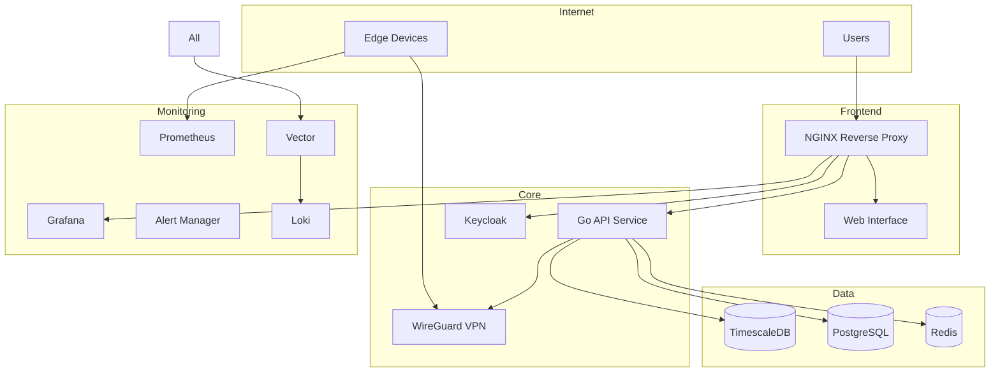

# We4Bee Server Deployment

This directory contains the deployment configuration and management tools for the We4Bee server infrastructure. The system provides a centralized hub for managing beehive monitoring devices, collecting sensor data, and providing visualization and analysis capabilities.

## System Overview

### Components
- **TimescaleDB**: Time-series data storage for sensor readings
- **PostgreSQL**: Application data storage (user preferences, configurations)
- **Keycloak**: Authentication and authorization
- **Prometheus & Grafana**: Monitoring and visualization
- **Redis**: Caching and rate limiting
- **Vector & Loki**: Log aggregation and management
- **WireGuard**: VPN for edge device connectivity
- **Go API Service**: Core application service
- **Alert Manager**: System alerts and notifications

### Architecture



## Prerequisites

- Linux server with podman and podman-compose installed
- Domain name with DNS records configured
- SSL certificates for your domain
- At least 8GB RAM and 4 CPU cores
- Minimum 100GB storage
- Properly configured firewall

## Initial Setup

1. Clone the repository:
   ```bash
   git clone https://github.com/itsatony/w4b_v3.git
   cd server/w4b_containers
   ```

2. Create required directories:
   ```bash
   mkdir -p data/timescaledb data/postgres data/redis
   mkdir -p data/prometheus data/grafana data/loki
   ```

3. Configure secrets:
   ```bash
   # Install Mozilla SOPS
   sudo dnf install sops  # Fedora/RHEL
   sudo apt install sops  # Ubuntu/Debian

   # Generate GPG key for secrets encryption
   gpg --full-generate-key

   # Initialize secrets
   cd secrets
   ./init-secrets.sh
   ```

4. Configure environment:
   ```bash
   cp .env.example .env
   # Edit .env with your settings
   ```

5. Install management tool:
   ```bash
   cd hivectl
   ./setup.sh
   ```

## Configuration

### Key Files and Directories
```
deployment/
├── compose.yaml          # Main compose file
├── config/              # Service configurations
│   ├── prometheus/
│   ├── grafana/
│   ├── keycloak/
│   └── ...
├── scripts/             # Management scripts
├── secrets/             # Encrypted secrets
└── data/               # Persistent data
```

### Network Configuration

1. Configure WireGuard:
   ```bash
   hivectl config vpn
   ```

2. Set up reverse proxy:
   ```nginx
   # /etc/nginx/conf.d/we4bee.conf
   server {
       listen 443 ssl http2;
       server_name we4bee.network;
       
       # SSL configuration
       ssl_certificate /path/to/cert.pem;
       ssl_certificate_key /path/to/key.pem;
       
       # Frontend
       location / {
           proxy_pass http://localhost:8080;
       }
       
       # API
       location /api {
           proxy_pass http://localhost:8081;
       }
       
       # Keycloak
       location /auth {
           proxy_pass http://localhost:8443;
       }
       
       # Grafana
       location /grafana {
           proxy_pass http://localhost:3000;
       }
   }
   ```

## Operation

### Starting the System

1. Start all services:
   ```bash
   hivectl start
   ```

2. Verify status:
   ```bash
   hivectl status
   ```

3. Check health:
   ```bash
   hivectl health
   ```

### Monitoring

1. Access Grafana:
   - URL: https://your-domain/grafana
   - Default credentials in secrets

2. View system metrics:
   ```bash
   hivectl stats --full
   ```

3. Check logs:
   ```bash
   hivectl logs <service-name>
   ```

### Maintenance

1. Update services:
   ```bash
   hivectl update
   ```

2. Cleanup:
   ```bash
   hivectl cleanup
   ```

3. Backup data:
   ```bash
   ./scripts/backup.sh
   ```

## Troubleshooting

### Common Issues

1. Service Won't Start
   ```bash
   # Check logs
   hivectl logs <service>
   
   # Verify configuration
   hivectl config
   
   # Check resource usage
   hivectl stats
   ```

2. Network Issues
   ```bash
   # Check VPN status
   hivectl vpn
   
   # View network configuration
   hivectl networks
   ```

3. Database Issues
   ```bash
   # Check database status
   hivectl stats timescaledb
   hivectl stats postgres_app
   
   # View logs
   hivectl logs timescaledb
   ```

### Health Checks

The system includes automated health checks:
```bash
# Run full health check
hivectl health

# Check specific service
hivectl debug <service>
```

### Logs

Centralized logging is available through Vector and Loki:
1. Access Grafana
2. Navigate to Explore
3. Select Loki data source
4. Query logs using LogQL

## Security

### Network Security
- All internal services are isolated in their own networks
- Edge devices can only access necessary services
- All external access is through NGINX with SSL

### Authentication
- Keycloak manages all authentication
- Role-based access control
- OAuth2/OpenID Connect integration

### Secrets Management
- All secrets are encrypted using SOPS
- Secrets are mounted securely into containers
- Regular secret rotation is recommended

## Backup and Recovery

1. Automatic Backups:
   - Daily database backups
   - Configuration backups
   - Log archives

2. Manual Backup:
   ```bash
   ./scripts/backup.sh full
   ```

3. Restore:
   ```bash
   ./scripts/restore.sh <backup-date>
   ```

## Maintenance Tasks

### Daily
- Check system health
- Review alerts
- Monitor resource usage

### Weekly
- Review logs
- Update services
- Cleanup unused resources

### Monthly
- Rotate secrets
- Review backup status
- Check SSL certificates
